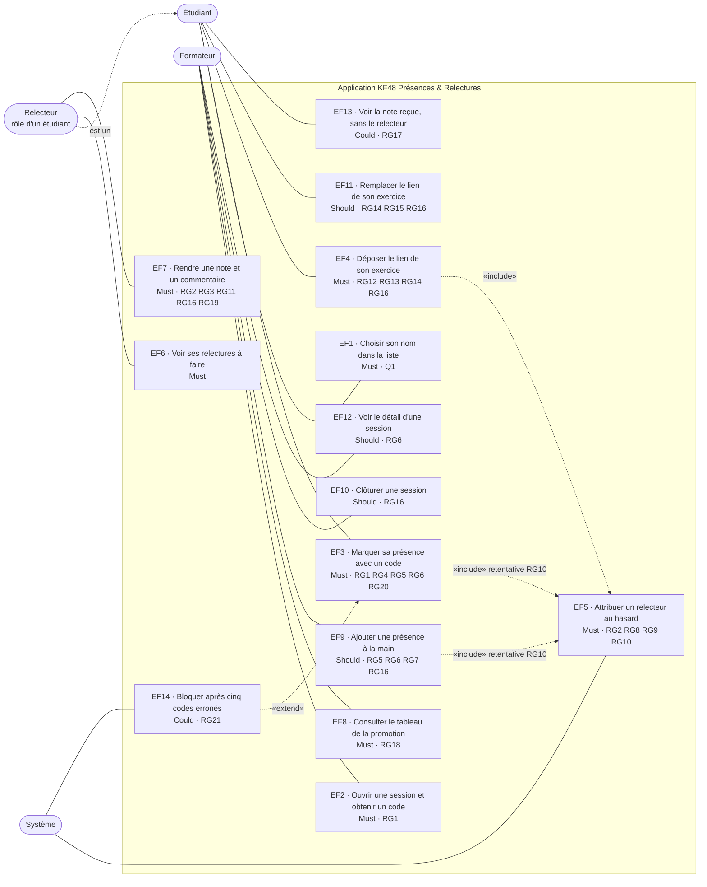

# D1 — Cas d'utilisation

Acteurs et ce que chacun peut faire. Chaque cas renvoie à son exigence (EFx) et à ses règles (RGx) du [cahier des charges](../CAHIER_DES_CHARGES.md).

Le **relecteur n'est pas un acteur distinct** : c'est un étudiant dans un rôle (section 2 du cahier des charges). Le lien « est un » le montre.

## Lecture

| Acteur | Cas d'utilisation | Remarque |
|---|---|---|
| Formateur | EF2, EF8, EF9, EF10, EF12 | Pas de compte, formateur unique (Q1) |
| Étudiant | EF1, EF3, EF4, EF11, EF13 | Identité choisie dans une liste, sans mot de passe (Q1) |
| Relecteur | EF6, EF7 (et tout ce que fait un étudiant) | Rôle porté par l'entité `relecture` (colonne `relecteur_id`), voir D2 |
| Système | EF5, EF14 | Le tirage est déclenché par un dépôt (EF4) ou par toute nouvelle présence (EF3, EF9) quand des exercices attendent un relecteur (RG10) |
