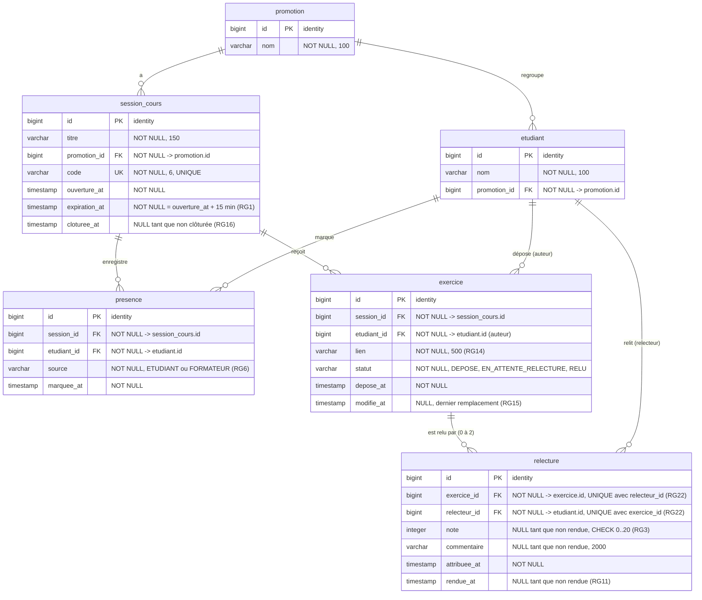

# D2 — Modèle de données

Ce diagramme décrit **exactement** les tables et colonnes produites par les migrations Flyway **V1__schema.sql** puis **V3__deux_relecteurs.sql** (V2 ne contient que des données de démonstration). Version 2 (étape 3) : **conséquence du changement de besoin double relecture**. Toute évolution du schéma passe par une nouvelle migration (**V2__…**, **V3__…**) **et** par la mise à jour de ce fichier dans le même commit.

Choix structurants (cahier des charges, sections 2 et 7) :
- le **relecteur n'a pas de table** : c'est un **etudiant** référencé par **relecture.relecteur_id** ;
- la **relecture est une entité séparée**, liée à un **exercice** (0, 1 ou 2 relectures par exercice, RG8) et à l'étudiant relecteur ; un même étudiant ne relit pas deux fois le même exercice (RG22) ;
- une ligne **relecture** n'existe **que lorsqu'un relecteur est attribué** : un exercice sans relecture est au statut **DEPOSE** (RG10) ;
- la table s'appelle **session_cours** et non **session**, pour éviter un mot réservé SQL ;
- l'état d'une session (**OUVERTE**, **EXPIREE**, **CLOTUREE**) **n'est pas stocké** : il se déduit de **expiration_at** et **cloturee_at** ;
- ni la note d'un exercice ni la moyenne ne sont stockées : l'API les calcule à partir de **relecture.note** (RG18, RG23), et en déduit le caractère **provisoire**.

## Contraintes des migrations V1 et V3 et règles qu'elles protègent

| Table | Contrainte SQL | Règle |
|---|---|---|
| **session_cours** | **UNIQUE (code)** | Un code désigne une seule session |
| **presence** | **UNIQUE (session_id, etudiant_id)** | RG5 — une présence par étudiant et par session (**409 DEJA_PRESENT**) |
| **presence** | **CHECK (source IN ('ETUDIANT', 'FORMATEUR'))** | RG6 — source visible dans le tableau (Q14) |
| **exercice** | **UNIQUE (session_id, etudiant_id)** | RG12 — un exercice par étudiant et par session (**409 EXERCICE_DEJA_DEPOSE**) |
| **exercice** | **CHECK (statut IN ('DEPOSE', 'EN_ATTENTE_RELECTURE', 'RELU'))** | Cycle de vie, voir D4 |
| **relecture** | ~~**UNIQUE (exercice_id)**~~ supprimée par **V3** | Ancienne RG8 (un seul relecteur, Q6), remplacée à l'étape 3 |
| **relecture** | **UNIQUE (exercice_id, relecteur_id)**, ajoutée par **V3** | RG22 — deux relecteurs différents ; au plus deux relectures par exercice est garanti par le service (RG8) |
| **relecture** | **CHECK (note IS NULL OR note BETWEEN 0 AND 20)** | RG3 — note entière de 0 à 20 (le type **integer** interdit les décimales) |

Règles vérifiées **dans le service** et non en base, car elles dépendent de plusieurs tables ou de l'heure :
- RG2 et RG19 : **relecture.relecteur_id** différent de **exercice.etudiant_id**, et seul le relecteur attribué rend la relecture ;
- RG8 et RG9 : au plus deux relecteurs, choisis parmi les **presence** de la même **session_cours** ;
- bug #26 : les écritures d'une même session sont sérialisées par un verrou sur la ligne **session_cours** (SELECT … FOR UPDATE) ;
- RG1, RG4, RG16 : comparaison de l'heure courante avec **expiration_at** et **cloturee_at** ;
- RG20 : **etudiant.promotion_id** égal à **session_cours.promotion_id**.

Hors V1 et V3 : le blocage après cinq codes erronés (EF14, RG21, Could) demandera une migration supplémentaire s'il est réalisé.
