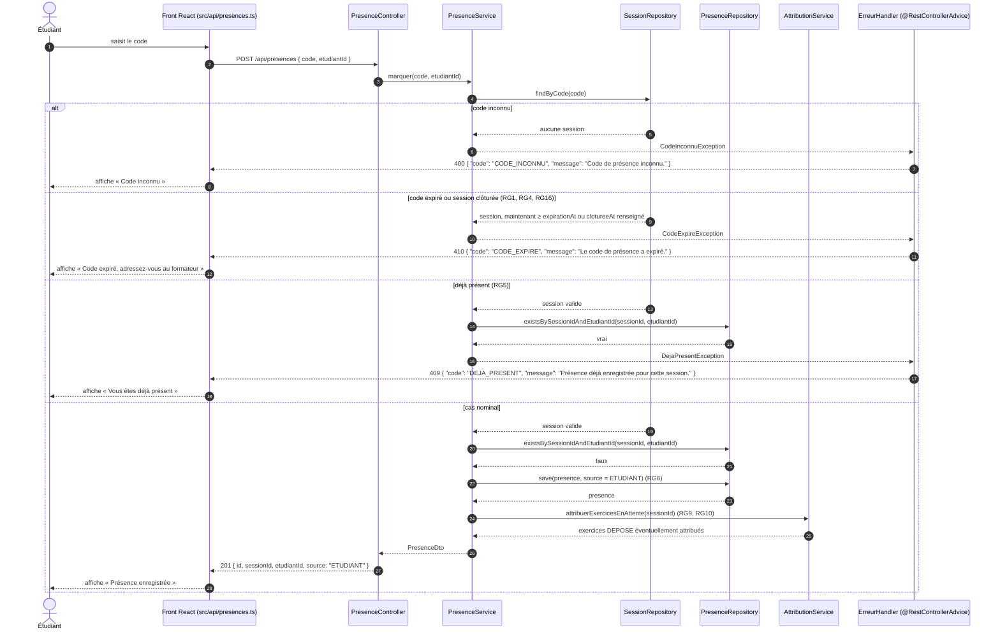

# D3 — Séquence : marquer sa présence

Opération imposée **POST /api/presences** (EF3). Les codes HTTP et les codes d'erreur sont **exactement** ceux de [api/contrat.yaml](../../api/contrat.yaml) : **201**, **400 CODE_INCONNU**, **409 DEJA_PRESENT**, **410 CODE_EXPIRE**. Toute erreur passe par le **@RestControllerAdvice** et renvoie **{ "code": "...", "message": "..." }** (ENF4).

Règles citées : RG1 et RG4 (expiration du code, fin de session), RG5 (une seule présence), RG6 (source **ETUDIANT**), RG9 et RG10 (retentative d'attribution d'un relecteur), RG16 (session clôturée).

## Correspondance avec le contrat

| Branche | Statut HTTP | Code d'erreur | Règle |
|---|---|---|---|
| Code inconnu | 400 | **CODE_INCONNU** | — |
| Code expiré ou session clôturée | 410 | **CODE_EXPIRE** | RG1, RG4, RG16 |
| Déjà présent | 409 | **DEJA_PRESENT** | RG5 |
| Cas nominal | 201 | — (corps **{ id, sessionId, etudiantId, source }**) | RG6, RG10 |

**Ordre des contrôles** : le code est d'abord cherché, puis sa validité, puis l'unicité de la présence. Un étudiant déjà présent qui ressaisit un code expiré reçoit donc **410**.

**Autres 400 possibles, hors du schéma pour le garder lisible** : champ manquant (**REQUETE_INVALIDE**, rejeté par la validation avant le service), étudiant inconnu (**ETUDIANT_INCONNU**), étudiant d'une autre promotion (**ETUDIANT_HORS_PROMOTION**, RG20). Le blocage après cinq erreurs (EF14, RG21) est Could et n'apparaît pas ici.
