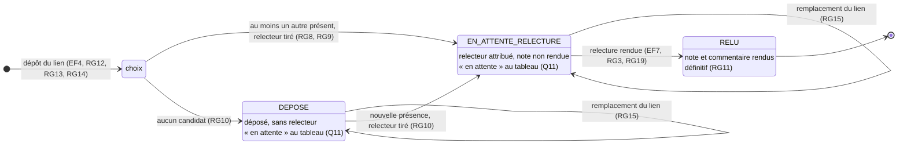

# D4 — États-transitions d'un exercice (bonus)

Cycle de vie de la colonne **exercice.statut** (voir D2) : **déposé → en attente de relecture → relu**. Les valeurs sont celles renvoyées par l'API dans le champ **statut**.

Règles citées : RG8, RG9, RG10 (attribution), RG11 (relecture définitive), RG12, RG13, RG14 (dépôt), RG15 (remplacement du lien), RG16 (clôture).

## Effet de la clôture (RG16)

La clôture d'une session **ne change pas le statut** de ses exercices : elle les **fige**. Après clôture, aucune transition n'est plus possible (ni remplacement, ni attribution, ni relecture, réponse **409 SESSION_CLOTUREE**). Un exercice resté **DEPOSE** ou **EN_ATTENTE_RELECTURE** apparaît définitivement « en attente » dans le tableau du formateur (Q11).

| Transition | Déclencheur | Refusée si | Règle |
|---|---|---|---|
| → **DEPOSE** ou **EN_ATTENTE_RELECTURE** | **POST /api/exercices** | lien invalide (**400**), déjà déposé (**409**), session clôturée (**409**) | RG12, RG13, RG14, RG16 |
| **DEPOSE** → **EN_ATTENTE_RELECTURE** | nouvelle présence dans la session | session clôturée | RG10, RG16 |
| remplacement du lien | **PUT /api/exercices/{id}** | relecture rendue ou session clôturée (**409**) | RG15, RG16 |
| **EN_ATTENTE_RELECTURE** → **RELU** | **POST /api/relectures/{id}** | note invalide (**400**), auto-relecture (**403**), déjà rendue (**409**), session clôturée (**409**) | RG2, RG3, RG11, RG16, RG19 |
